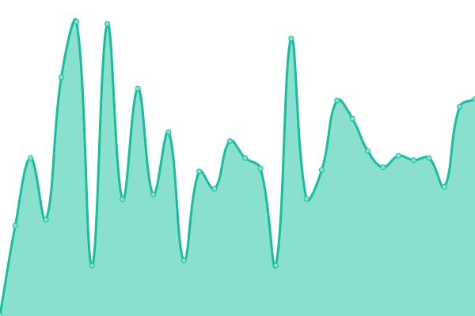
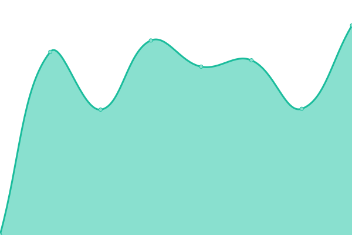

# [📈 Live Status](https://status.8select.io): <!--live status--> **🟩 All systems operational**

This repository contains the open-source uptime monitor and status page for [8SELECT GmbH](https://www.8select.com), powered by [Upptime](https://github.com/upptime/upptime).

With [Upptime](https://upptime.js.org), you can get your own unlimited and free uptime monitor and status page, powered entirely by a GitHub repository. We use [Issues](https://github.com/8select/status.8select.io/issues) as incident reports, [Actions](https://github.com/8select/status.8select.io/actions) as uptime monitors, and [Pages](https://status.8select.io) for the status page.

<!--start: status pages-->
<!-- This summary is generated by Upptime (https://github.com/upptime/upptime) -->
<!-- Do not edit this manually, your changes will be overwritten -->
<!-- prettier-ignore -->
| URL | Status | History | Response Time | Uptime |
| --- | ------ | ------- | ------------- | ------ |
|  [8select Website](https://www.8select.com) | 🟩 Up | [8select-website.yml](https://github.com/8select/status.8select.io/commits/HEAD/history/8select-website.yml) | 

 234ms
     
 | 

<a href="https://status.8select.io/history/8select-website">99.22%</a>
    

|  [8select Admin Panel](https://app.8select.io/) | 🟩 Up | [8select-admin-panel.yml](https://github.com/8select/status.8select.io/commits/HEAD/history/8select-admin-panel.yml) | 

 1043ms
     
 | 

<a href="https://status.8select.io/history/8select-admin-panel">100.00%</a>
    

|  [8select GraphQL API](https://api.8select.io/graphql) | 🟩 Up | [8select-graph-ql-api.yml](https://github.com/8select/status.8select.io/commits/HEAD/history/8select-graph-ql-api.yml) | 

 1095ms
     
 | 

<a href="https://status.8select.io/history/8select-graph-ql-api">100.00%</a>
    

<!--end: status pages-->

[**Visit our status website →**](https://status.8select.io)

## 📄 License

- Powered by: [Upptime](https://github.com/upptime/upptime)
- Code: [MIT](./LICENSE) © [Anand Chowdhary](https://anandchowdhary.com), supported by [Pabio](https://pabio.com)
- Data in the `./history` directory: [Open Database License](https://opendatacommons.org/licenses/odbl/1-0/)
